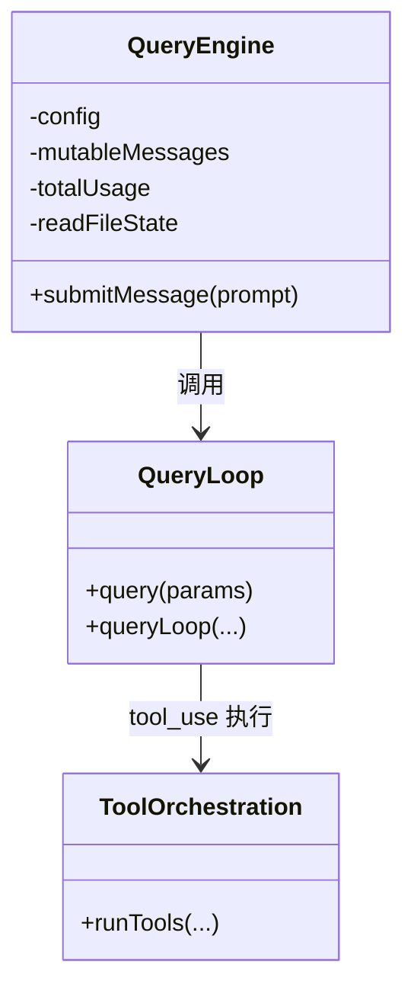
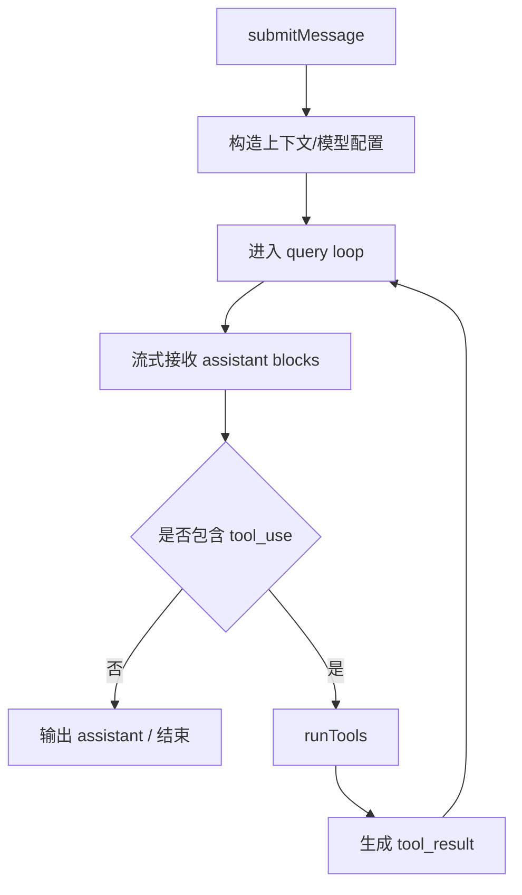

# 深挖 01：核心循环（`QueryEngine.ts` + `query.ts`）

## 1. 分析目标

理解 ClaudeCode 如何把“多轮会话 + 工具调用 + 预算治理”收敛为可持续运行的 query runtime。

## 2. 核心对象关系（简化类图）



## 3. 关键执行流程



## 4. 重点机制

- **会话状态持久化在内存对象**：`QueryEngine` 持有 `mutableMessages`、`totalUsage` 等跨轮状态。
- **主循环可恢复**：`query.ts` 中围绕 token 上限、compact、stop hooks 做恢复/切换。
- **模型与工具解耦**：query 负责状态机与策略，tool 执行由独立 orchestration 层处理。

## 5. 建议阅读顺序

1. `QueryEngine.submitMessage`（输入到状态初始化）
2. `query()` / `queryLoop()`（状态迁移主路径）
3. 与 compact/budget/stop hooks 的交点
4. 终止态和错误态处理

## 6. 学习产出模板

- 画一张“单轮 + 工具回环”的时序图。
- 记录 3 个终止条件（正常完成、预算耗尽、错误中断）。
- 记录 2 个恢复路径（compact 恢复、max_output_tokens 恢复）。

## 7. 真实代码调用路径（函数级追踪）

- `QueryEngine.ts::submitMessage`
  -> `query.ts::query`
  -> `query.ts::queryLoop`（内部状态机迭代）
  -> `services/tools/toolOrchestration.ts::runTools`
  -> 回注 `tool_result` 后继续 `queryLoop`。
- `query.ts` 关键分支：
  - token/预算治理：`query/tokenBudget.ts` 中预算检查函数。
  - stop hooks：`query/stopHooks.ts::handleStopHooks`。
  - 配置构建：`query/config.ts::buildQueryConfig`。

---

## 附录：纯文本可读视图（Mermaid 失效时阅读）

### A. 类关系（纯文本）

```text
QueryEngine
  - 持有会话状态（messages/usage/cache）
  - 调用 QueryLoop

QueryLoop
  - 执行 query/queryLoop 主状态机
  - 遇到 tool_use 时调用 ToolOrchestration

ToolOrchestration
  - 负责工具调度与上下文回写
```

### B. 执行流程（纯文本）

```text
submitMessage
  -> 构造上下文/模型配置
  -> 进入 query loop
  -> 接收 assistant blocks
  -> 若有 tool_use: runTools -> 生成 tool_result -> 回到 query loop
  -> 若无 tool_use: 输出 assistant/结束
```

### C. ASCII 版主流程

```text
+------------------+
| submitMessage    |
+------------------+
         |
         v
+------------------+
| build context    |
+------------------+
         |
         v
+------------------+
| query loop       |<------------------------------+
+------------------+                               |
         |                                         |
         v                                         |
+------------------+   yes   +------------------+  |
| has tool_use ?   |-------->| runTools         |  |
+------------------+         +------------------+  |
         | no                      |               |
         v                         v               |
+------------------+      +------------------+     |
| output/terminal  |      | tool_result      |-----+
+------------------+      +------------------+
```
