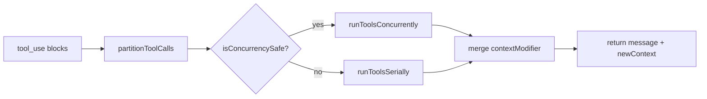

# 深挖 02：工具执行链（`services/tools/toolOrchestration.ts` + `services/tools/toolExecution.ts`）

## 1. 分析目标

理解 ClaudeCode 如何在“正确性优先”前提下最大化工具执行吞吐。

## 2. 调度策略总览



## 3. 设计要点

- **并发安全判定**：基于 tool input schema + `isConcurrencySafe` 回调。
- **批次化执行**：连续只读工具可以并发，副作用工具串行。
- **上下文一致性**：并发分支先收集 contextModifier，再按 block 顺序应用。
- **并发上限可配置**：由 `CLAUDE_CODE_MAX_TOOL_USE_CONCURRENCY` 控制。

## 4. 为什么这套设计重要

- 避免“全串行”导致慢。
- 避免“全并发”导致状态污染。
- 在 agent 执行可靠性与性能之间取得可解释平衡。

## 5. 推荐分析切片

1. `partitionToolCalls` 的分批逻辑。
2. `runToolsConcurrently` 与 `all(...)` 的并发模型。
3. `markToolUseAsComplete` 与 in-progress 集合管理。
4. contextModifier 应用顺序为何必须稳定。

## 6. 建议补充实验

- 将并发上限从 10 调到 1/20，观察耗时与日志差异。
- 模拟一个“并发安全误判”为 true 的工具，验证状态污染风险。

## 7. 真实代码调用路径（函数级追踪）

- `query.ts::runTools` 调用入口
  -> `services/tools/toolOrchestration.ts::runTools`
  -> `partitionToolCalls`
  -> `runToolsConcurrently` 或 `runToolsSerially`
  -> `services/tools/toolExecution.ts::runToolUse`
  -> 产出 `message/contextModifier` 返回 query loop。
- 并发状态追踪：
  - 入队：`setInProgressToolUseIDs(add)`
  - 出队：`markToolUseAsComplete(delete)`。

---

## 附录：纯文本可读视图（Mermaid 失效时阅读）

```text
tool_use blocks
  -> partitionToolCalls
  -> 判断 isConcurrencySafe
     - true  -> runToolsConcurrently
     - false -> runToolsSerially
  -> 合并 contextModifier
  -> 返回 message + newContext
```
