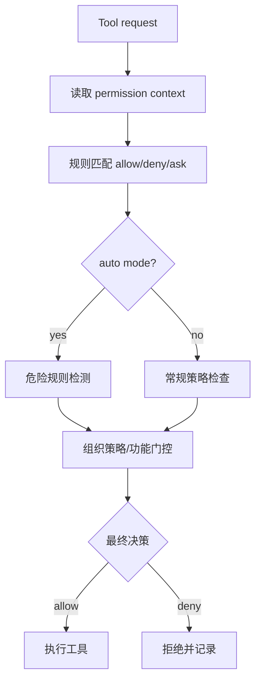

# 深挖 03：权限体系（`utils/permissions/permissionSetup.ts` + `utils/permissions/permissions.ts`）

## 1. 分析目标

理解 ClaudeCode 如何把“安全策略”落地为运行时可执行机制，而非文档约定。

## 2. 权限决策流程图



## 3. 关键能力

- **权限模式建模**：将默认、自动、计划模式等行为显式编码。
- **危险模式识别**：对 Bash / PowerShell 等规则做高风险匹配（如脚本解释器通配）。
- **策略融合**：结合本地设置、组织策略、特性开关统一决策。
- **状态回写**：权限拒绝与模式迁移会反馈至会话状态。

## 4. 安全设计价值

- 防止“看似合法规则”在自动模式下绕过安全审查。
- 将高风险命令控制点前置到“执行前”。
- 支持企业治理（policy）与个人配置并存。

## 5. 推荐阅读顺序

1. `permissionSetup.ts` 中 permission context 初始化。
2. 危险规则检测函数（Bash/PowerShell/Task）。
3. permission update 的写入路径与来源分层。
4. 自动模式/计划模式迁移对权限语义的影响。

## 6. 真实代码调用路径（函数级追踪）

- 初始化路径：
  - `utils/permissions/permissionSetup.ts::initializeToolPermissionContext`
  - `utils/permissions/permissions.ts::applyPermissionRulesToPermissionContext`
- 风险处理路径：
  - `findDangerousClassifierPermissions`
  - `stripDangerousPermissionsForAutoMode`
  - `removeDangerousPermissions`
- 模式迁移路径：
  - `transitionPermissionMode`
  - `transitionPlanAutoMode`
  - 配合 `bootstrap/state.ts` 中计划/自动模式状态切换字段。

---

## 附录：纯文本可读视图（Mermaid 失效时阅读）

```text
Tool request
  -> 读取 permission context
  -> 规则匹配（allow/deny/ask）
  -> 判断是否 auto mode
     - auto: 危险规则检测
     - 非 auto: 常规策略检查
  -> 组织策略/功能门控
  -> 最终 allow 或 deny
  -> allow 执行工具；deny 记录并拒绝
```
