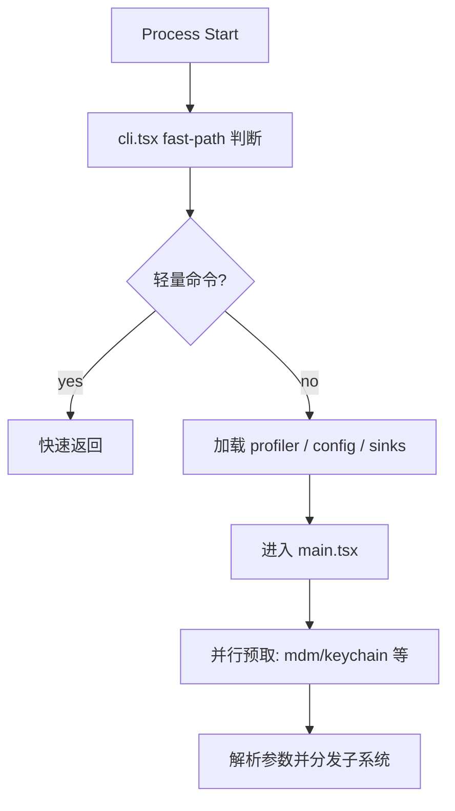

# 深挖 04：启动优化（`entrypoints/cli.tsx` + `main.tsx`）

## 1. 分析目标

理解 ClaudeCode 为何在功能复杂的前提下仍重视 CLI 启动时延，以及如何实现。

## 2. 启动分层流程



## 3. 关键机制

- **Fast Path**：`--version`、特定子命令可绕过大部分模块加载。
- **动态导入**：仅在命中功能时加载对应模块。
- **启动预取**：在 import 阶段并行触发部分系统读取，隐藏 IO 延迟。
- **Feature Gate + DCE**：同仓支撑多版本能力，减少无关代码执行。

## 4. 性能与可维护性的平衡

- 优势：低延迟、可按能力裁剪、模块边界清晰。
- 代价：启动路径分支增多，调试复杂度上升。

## 5. 推荐阅读切片

1. `cli.tsx` 中 fast-path 分发顺序。
2. `main.tsx` 顶层 side-effects 与 profiler checkpoint。
3. 子系统初始化（settings/policy/mcp/plugins）的时机。
4. “何时 return/exit” 的控制差异。

## 6. 真实代码调用路径（函数级追踪）

- 入口分发：
  - `entrypoints/cli.tsx::main`
  - fast-path 分支（如 `--version`、`daemon`、`remote-control`）
  - 命中后动态 import 对应子模块
- 主程序初始化：
  - `main.tsx` 顶层 `profileCheckpoint`
  - `startMdmRawRead` / `startKeychainPrefetch`
  - `entrypoints/init.ts::init`（初始化配置、能力、状态）
  - 最终进入 REPL/非交互执行路径。

---

## 附录：纯文本可读视图（Mermaid 失效时阅读）

```text
Process Start
  -> cli.tsx fast-path 判断
  -> 若轻量命令：快速返回
  -> 否则：加载 profiler/config/sinks
  -> 进入 main.tsx
  -> 并行预取（mdm/keychain）
  -> 解析参数并分发子系统
```

### ASCII 版启动分层图

```text
[Process Start]
      |
      v
[cli.tsx fast-path?]--yes-->[quick return]
      |
      no
      v
[load profiler/config/sinks]
      |
      v
[enter main.tsx]
      |
      v
[prefetch mdm/keychain]
      |
      v
[parse args & dispatch subsystem]
```
