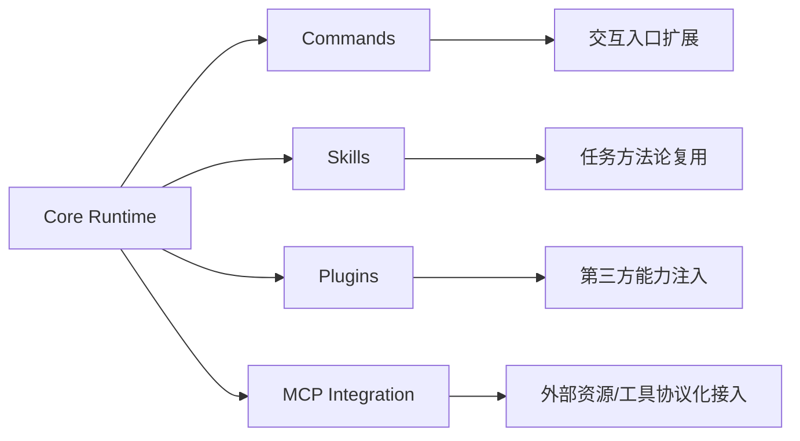

# 深挖 05：生态扩展（`commands.ts` + `skills/` + `services/mcp/`）

## 1. 分析目标

理解 ClaudeCode 如何把“能力增长”从核心运行时解耦出来，做成可扩展文档库与扩展生态。

## 2. 扩展面结构图



## 3. 四种扩展机制定位

- **Commands**：面向用户入口，定义操作语义与交互方式。
- **Skills**：面向任务模板，沉淀可复用执行策略。
- **Plugins**：面向生态集成，承载第三方能力。
- **MCP**：面向协议连接，统一外部工具与资源。

## 4. 关键设计原则

1. **核心稳定，外围可变**：runtime 不随业务频繁变动。
2. **按源分层加载**：builtin / dynamic / plugin skills 分离。
3. **策略先于执行**：扩展能力接入后仍受权限和 policy 约束。
4. **可观测优先**：扩展能力应进入统一日志与状态体系。

## 5. 推荐阅读顺序

1. `commands.ts`：命令注册、feature gate、动态加载。
2. `skills/loadSkillsDir.ts`：技能扫描、缓存、动态命令注入。
3. `services/mcp/client.ts`：MCP 工具/资源聚合与连接生命周期。
4. `utils/plugins/*`：插件命令与技能加载路径。

## 6. 文档库建设建议（面向本仓库）

- 每个扩展机制单独维护“设计说明 + 时序图 + 常见坑”。
- 建立统一模板：背景、边界、流程、风险、演进建议。
- 每次新增分析文档都在 `README.md` 和索引页登记。

## 7. 真实代码调用路径（函数级追踪）

- 命令聚合链路：
  - `commands.ts::getCommands`
  - `skills/loadSkillsDir.ts::getDynamicSkills`
  - `utils/plugins/loadPluginCommands.ts::getPluginCommands`
  - 合并后形成可用命令列表。
- MCP 聚合链路：
  - `services/mcp/client.ts::getMcpToolsCommandsAndResources`
  - 输出 MCP tools/commands/resources
  - 回注到 runtime 的工具与命令上下文。

---

## 附录：纯文本可读视图（Mermaid 失效时阅读）

```text
Core Runtime
  -> Commands   (交互入口扩展)
  -> Skills     (任务方法论复用)
  -> Plugins    (第三方能力注入)
  -> MCP        (外部资源/工具协议化接入)
```
