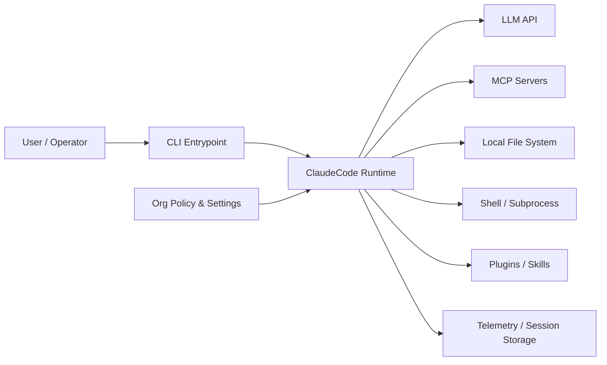
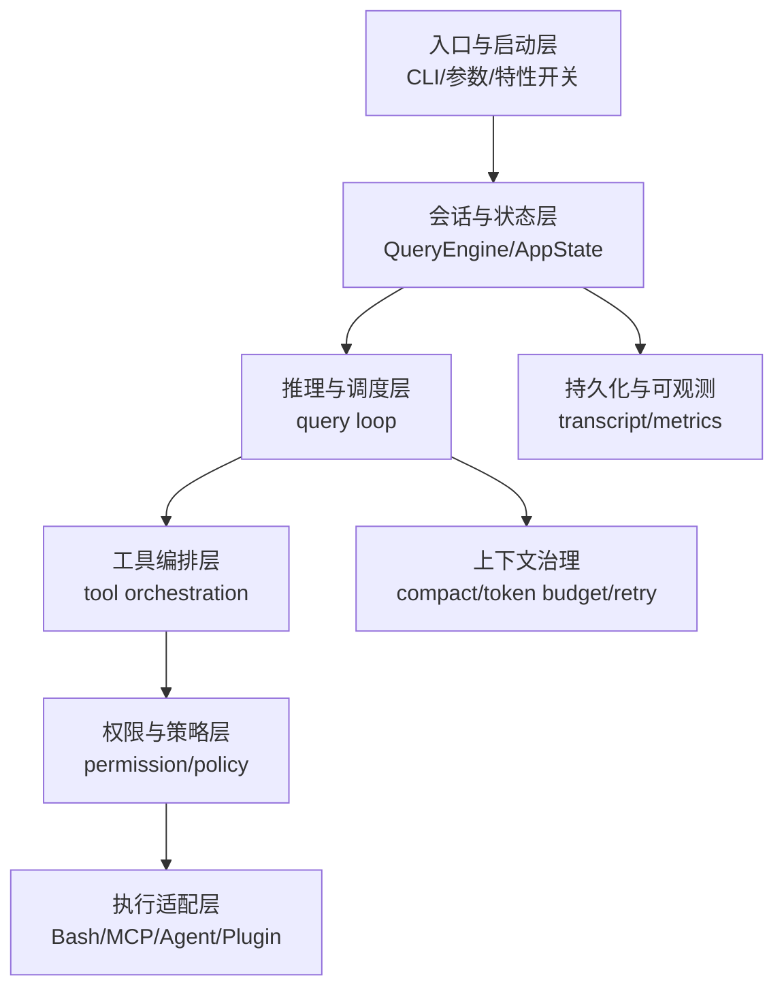
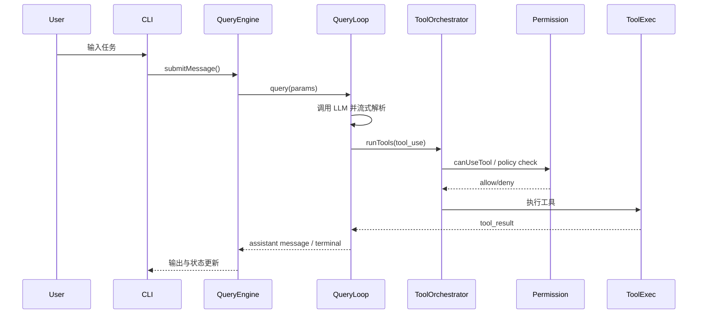

# ClaudeCode 系统边界与核心职责逻辑视图

> 本文用于回答两个问题：
> 1) ClaudeCode 系统“到哪里为止”？
> 2) 每个核心模块负责什么，以及模块之间如何协作？

## 1. 系统边界（System Boundary）

从运行时角度，ClaudeCode 可以看作一个 **Agent Runtime**，边界分成三层：

- **系统内（Core Runtime）**：CLI 启动、会话状态、推理循环、工具编排、权限治理、持久化与观测。
- **受控外部依赖（Managed External）**：LLM API、MCP Server、Git/FS/Shell、插件与技能目录。
- **非受控环境（Unmanaged Environment）**：用户本地 OS、企业策略环境、第三方服务可用性。

### 1.1 系统上下文图（Context Diagram）



---

## 2. 核心职责逻辑视图（Logical View）

## 2.1 分层职责图



### 各层核心职责

1. **入口与启动层**
   - 处理 fast path、子命令分流、动态加载、特性开关。
2. **会话与状态层**
   - 维护多轮消息、预算、权限拒绝、文件状态缓存。
3. **推理与调度层**
   - 执行“模型输出 -> 工具调用 -> 结果回注 -> 再推理”的主循环。
4. **工具编排层**
   - 根据并发安全性做分批并发/串行执行，维护上下文一致性。
5. **权限与策略层**
   - 在工具执行前实施安全约束、自动模式限制、组织策略限制。
6. **执行适配层**
   - 将抽象工具映射到具体执行介质（Shell/MCP/Agent/Plugin）。

---

## 3. 关键交互时序（主链路）



---

## 4. 边界内非功能性职责

- **性能**：fast path + 延迟加载 + 启动预取。
- **可靠性**：重试、预算控制、上下文压缩、异常恢复。
- **安全性**：权限模式、危险规则识别、策略限制。
- **可扩展性**：commands/skills/plugins/MCP 的模块化扩展。
- **可观测性**：日志、用量、会话记录、事件埋点。

---

## 5. 文档索引（与深挖文档对应）

- `docs/deep-dives/01-query-core.md`
- `docs/deep-dives/02-tool-execution.md`
- `docs/deep-dives/03-permission-system.md`
- `docs/deep-dives/04-startup-boot.md`
- `docs/deep-dives/05-extensibility-ecosystem.md`
- `docs/deep-dives/06-state-and-storage.md`
- `docs/deep-dives/07-observability-and-telemetry.md`
- `docs/deep-dives/08-failure-recovery-patterns.md`

---

## 附录：纯文本可读视图（Mermaid 失效时阅读）

### A. 系统上下文图（纯文本）

```text
User/Operator
  -> CLI Entrypoint
  -> ClaudeCode Runtime
       -> LLM API
       -> MCP Servers
       -> Local File System
       -> Shell/Subprocess
       -> Plugins/Skills
Policy & Settings -> ClaudeCode Runtime
ClaudeCode Runtime -> Telemetry/Session Storage
```

### B. 分层职责图（纯文本）

```text
[入口与启动层]
  -> [会话与状态层]
  -> [推理与调度层]
  -> [工具编排层]
  -> [权限与策略层]
  -> [执行适配层]

并行支撑：
- 推理与调度层 -> 上下文治理（compact/token budget/retry）
- 会话与状态层 -> 持久化与可观测（transcript/metrics）
```

### C. 主链路时序图（纯文本）

```text
1) User 提交任务到 CLI
2) CLI 调用 QueryEngine.submitMessage
3) QueryEngine 进入 query(params)
4) QueryLoop 流式解析模型输出
5) 遇到 tool_use -> ToolOrchestrator.runTools
6) runTools 调用 Permission 做 allow/deny 判定
7) 允许后执行工具，产出 tool_result
8) tool_result 回注 QueryLoop，继续迭代
9) 终止后返回 assistant 输出与状态更新
```

### D. ASCII 版（推荐在无 Mermaid 环境阅读）

```text
[User]
   |
   v
[CLI Entrypoint]
   |
   v
[ClaudeCode Runtime]----------------------->[Telemetry/Session Storage]
   |    |         |         |       |
   |    |         |         |       +-->[Plugins/Skills]
   |    |         |         +---------->[Shell/Subprocess]
   |    |         +-------------------->[Local File System]
   |    +------------------------------>[MCP Servers]
   +----------------------------------->[LLM API]

[Org Policy & Settings] ------------------> [ClaudeCode Runtime]
```
