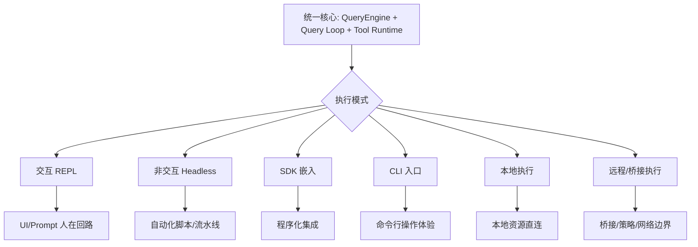

# ClaudeCode 架构执行模式对比

## 1. 交互 / 非交互

| 维度 | 交互模式（REPL） | 非交互模式（Headless/Print） |
|---|---|---|
| 用户交互 | 实时输入、UI反馈、权限弹窗 | 通过参数/输入流驱动，强调可脚本化 |
| 状态可视化 | 即时可视（消息、通知、工具进度） | 结构化输出与日志为主 |
| 权限处理 | 可 ask 用户 | 更依赖预设规则与回调 |
| 典型场景 | 人在回路协作编程 | 自动化流水线、批量任务 |

## 2. SDK / CLI

| 维度 | SDK | CLI |
|---|---|---|
| 集成方式 | 嵌入业务系统/应用 | 独立命令行入口 |
| 控制粒度 | 程序化回调、状态托管更细 | 操作门槛低、适合人工使用 |
| 可扩展点 | 通过 API 组合外部系统 | 通过 commands/skills/plugins/MCP |
| 输出消费 | 代码消费（事件流/结构化对象） | 人类消费（终端展示/日志） |

## 3. 本地 / 远程

| 维度 | 本地执行 | 远程/桥接执行 |
|---|---|---|
| 资源访问 | 直接访问本地 FS/Shell | 通过桥接会话与远端环境交互 |
| 安全边界 | 受本地权限/策略约束 | 叠加远端策略、网络与认证约束 |
| 性能特征 | I/O 与本机能力相关 | 额外网络延迟与同步成本 |
| 适用场景 | 单机开发、快速迭代 | 团队协作、受管控环境、远程仓库 |

## 4. 架构差异总结



## 5. 选型建议

- 需要人机协同与实时确认：优先交互 CLI。
- 需要自动化编排：优先非交互或 SDK。
- 需要企业合规与隔离：优先远程/桥接 + policy 管理。
- 需要快速试验：先本地 CLI，稳定后沉淀为 SDK 流程。

---

## 附录：纯文本可读视图（Mermaid 失效时阅读）

```text
统一核心：QueryEngine + Query Loop + Tool Runtime
  -> 交互 REPL（人在回路）
  -> 非交互 Headless（自动化）
  -> SDK 嵌入（程序化集成）
  -> CLI 入口（命令行体验）
  -> 本地执行（本地资源直连）
  -> 远程/桥接执行（网络与策略边界）
```

### ASCII 版模式总览图

```text
[Unified Core: QueryEngine + Query Loop + Tool Runtime]
      |
      +--> [Interactive REPL]
      +--> [Headless Non-Interactive]
      +--> [SDK Embedded]
      +--> [CLI Entrypoint]
      +--> [Local Execution]
      +--> [Remote/Bridge Execution]
```
