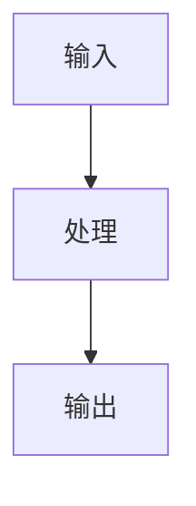

# 深挖专题模板（可复用）

## 1. 分析目标

- 该专题要回答的核心问题。

## 2. 边界与上下文

- 在系统中的位置。
- 输入/输出边界。

## 3. 核心流程图



## 4. 关键机制

- 机制 1
- 机制 2
- 机制 3

## 5. 真实代码调用路径（函数级追踪）

- `fileA.ts::fnA` -> `fileB.ts::fnB` -> `fileC.ts::fnC`

## 6. 风险与治理

- 风险点
- 控制点

## 7. 演进建议

- 可持续迭代方向。

## 附录：纯文本流程模板（Mermaid 失效时阅读）

```text
输入 -> 处理 -> 输出
```

## ASCII 流程模板（推荐）

```text
+--------+     +--------+     +--------+
| Input  | --> |Process | --> | Output |
+--------+     +--------+     +--------+
```
